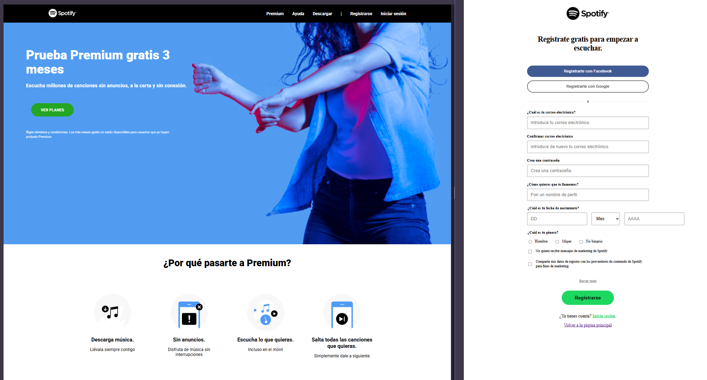

# Ejercicio de pair programming: Spotify

Este proyecto es un ejercicio de Pair Programming desarrollado durante el Módulo 1 del bootcamp de Adalab. El objetivo principal es replicar la interfaz de Spotify aplicando técnicas de maquetación.



> [!IMPORTANT]
> Este repositorio es un _fork_ del proyecto original realizado en pareja. He decidido continuar trabajando en él de forma individual poder seguir practicando.

## 🛠️ Tecnologías y Herramientas

- **HTML5**: Estructura semántica y uso de partials.
- **SASS**: Variables, arquitectura modular y estilos avanzados.
- **Flexbox & CSS Grid**: Diseño responsive y alineación de elementos.
- **Adalab Web Starter Kit**: Automatización con Gulp/Vite para el procesado de HTML y SASS.

## 🚀 Cómo ejecutar el proyecto

Para trabajar con este proyecto localmente, necesitas tener instalado **Node.js**. Sigue estos pasos:

1. **Instalar dependencias**:
   ```bash
   npm install
   ```
2. **Arrancar el servidor de desarrollo**:

   ```bash
   npm start
   ```

## 🧠 Aprendizajes clave de este ejercicio

En este proyecto he profundizado en conceptos fundamentales de desarrollo web:

- **Formularios Semánticos**: Uso de `fieldset`, `legend` y tipos de input específicos (`email`, `password`, `radio`) para mejorar la accesibilidad.
- **Validación nativa**: Implementación de atributos `required` y `pattern` con expresiones regulares para validar datos como la fecha de nacimiento.
- **Navegación**: Gestión de múltiples páginas (`index.html` y `signup.html`) y rutas relativas.
- **CSS Grid Avanzado**: Maquetación de estructuras complejas en formularios, alineando diferentes tamaños de campos en una sola fila.

## ✍️ Autoras

El proyecto original fue realizado en pareja por:

Mónica C. (https://github.com/mcocapelaz).

Cristina C.

---

> [!NOTE]
> **Repositorio original:** [promo-58-module-1-pair-5-spotify](https://github.com/mcocapelaz/promo-58-module-1-pair-5-spotify)
