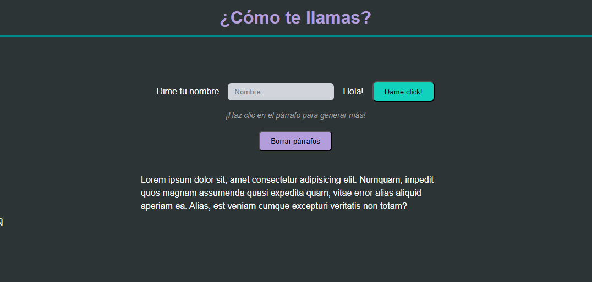

# Ejercicios de Manipulación del DOM y Eventos en JavaScript

Este proyecto es una aplicación web interactiva desarrollada para practicar la manipulación del Document Object Model (DOM) mediante eventos en JavaScript.

## 🛠️ Tecnologías utilizadas

- **HTML5**: Estructura semántica de la página.
- **CSS3**: Diseño adaptativo (Responsive) usando un enfoque _Desktop First_ y unidades relativas (`rem`).
- **JavaScript (ES6+)**: Lógica funcional, manipulación de eventos y manipulación dinámica del DOM.

## 🚀 Funcionalidades principales

- **Saludo Dinámico**: Permite al usuario ingresar su nombre y visualizar un saludo personalizado. El botón actúa como un interruptor (_toggle_) para mostrar u ocultar el nombre.
- **Generador de Párrafos**: Al hacer clic en el párrafo inicial, se generan dinámicamente nuevos bloques de texto con una marca de tiempo exacta.
- **Sistema de Limpieza**: Incluye una función para eliminar todos los párrafos generados dinámicamente, manteniendo intacta la estructura original de la página.
- **Diseño Responsive**: La interfaz se adapta a distintos tamaños de pantalla, optimizando la experiencia de usuario tanto en escritorio como en dispositivos móviles.

## 📁 Estructura del proyecto

- `index.html`: Estructura principal.
- `css/main.css`: Estilos visuales con Media Queries para adaptabilidad.
- `js/main.js`: Lógica de interacción y gestión del DOM.

## 💻 Instrucciones

Para visualizar el proyecto, simplemente abre el archivo `index.html` en tu navegador web. No requiere configuración adicional.
