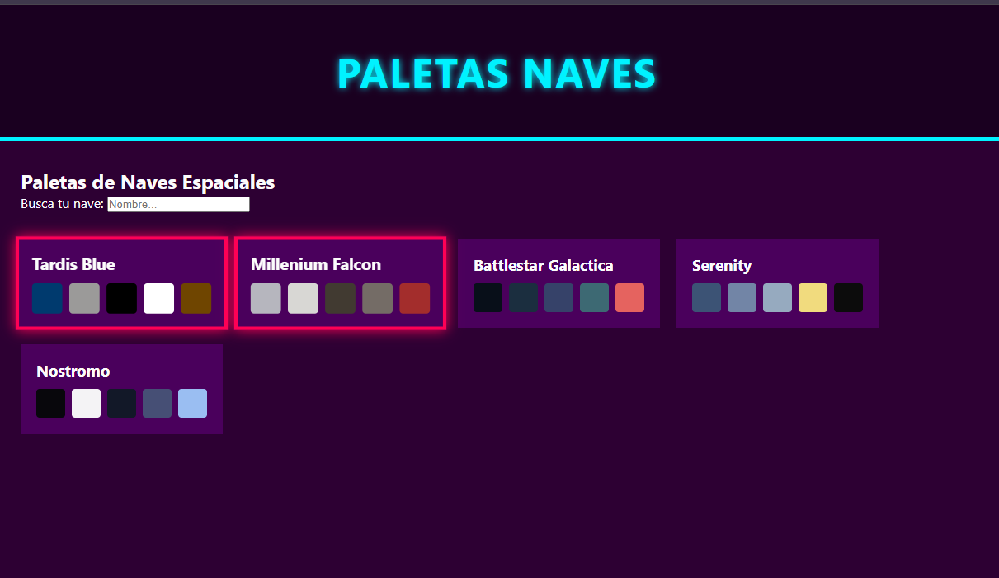

# Paletas de Naves Espaciales 🚀

Este proyecto es un **ejercicio práctico de desarrollo web** enfocado en el uso de JavaScript, consumo de APIs y gestión de datos en el navegador.
Una aplicación web interactiva para visualizar y gestionar paletas de colores inspiradas en naves espaciales. Diseñada con una estética Cyberpunk.



## 🛠 Características

- **Consumo de API**: Carga dinámica de paletas desde un servidor externo.
- **Persistencia de datos**: Guardado automático de tus paletas favoritas en `localStorage`.
- **Buscador en tiempo real**: Filtra instantáneamente entre todas las naves disponibles.
- **Estética Cyberpunk**: Interfaz inmersiva con colores neón y diseño responsive.
- **Código Limpio**: Implementación de prácticas profesionales con separación de responsabilidades.

## 🚀 Tecnologías utilizadas

- **HTML5**
- **CSS3** (con variables globales y Flexbox)
- **JavaScript**
- **LocalStorage API**
- **Fetch API**

## 💻 Cómo ejecutar el proyecto

1. Clona este repositorio.
2. Abre el archivo `index.html` en tu navegador.
3. ¡Explora, filtra y marca tus paletas favoritas!

## ⚙️ Estructura del proyecto

```text
/nombre-de-tu-proyecto
├── index.html
├── css/
│ └── main.css
├── js/
│ └── main.js
└── README.md
```

---
