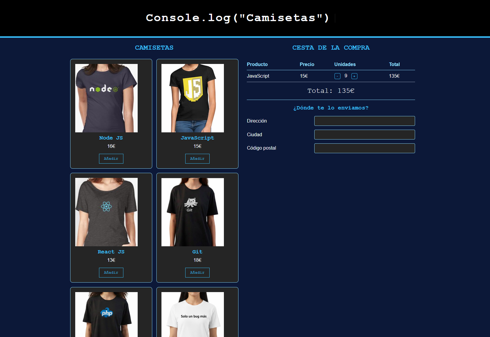

# Proyecto: Tienda de Camisetas - Ejercicio Práctico

Este proyecto consiste en la creación de una interfaz funcional de una tienda online, desarrollado como ejercicio práctico para el bootcamp de desarrollo web de **Adalab**. El objetivo principal ha sido poner en práctica la maquetación avanzada utilizando **SASS** y una estructura de archivos profesional.

## 📸 Captura de pantalla del proyecto



## 🎯 Objetivos del ejercicio

- **Arquitectura Modular**: Implementación de estilos mediante la metodología de `partials` para mantener un código limpio y escalable.
- **Diseño Responsivo**: Uso de **Flexbox** para la estructura de la página y **CSS Grid** para la gestión del catálogo de productos.
- **Componentización**: Creación de componentes independientes para las tarjetas de productos, la cesta de compra y el formulario de envío.
- **Interactividad**: Manipulación del DOM mediante JavaScript para la gestión dinámica de la cesta de compra y actualización de totales.

## 📁 Estructura del Proyecto

El proyecto sigue las buenas prácticas de organización recomendadas en el Starter Kit de Adalab:

```text
├── /core           # Variables y reset
├── /components     # Estilos modulares (_layout, _header, _cards, _cart, _shipping )
└── main.scss       # Punto de entrada y compilación
/js
└── main.js         # Lógica de la aplicación
index.html            # Estructura del documento
```

## 🛠 Tecnologías utilizadas

- **HTML5**
- **SASS (SCSS)**
- **JavaScript (Vanilla)**
- **Arquitectura de archivos basada en el Starter Kit de Adalab**

## 🚀 Cómo visualizar el proyecto

1. Clona el repositorio en tu máquina local.
2. Abre la carpeta en VS Code.
3. Asegúrate de tener activa la extensión _Live Sass Compiler_ para que los estilos se generen correctamente.
4. Abre el archivo `index.html` en tu navegador.

---

_Proyecto realizado como parte del programa formativo de Adalab._
